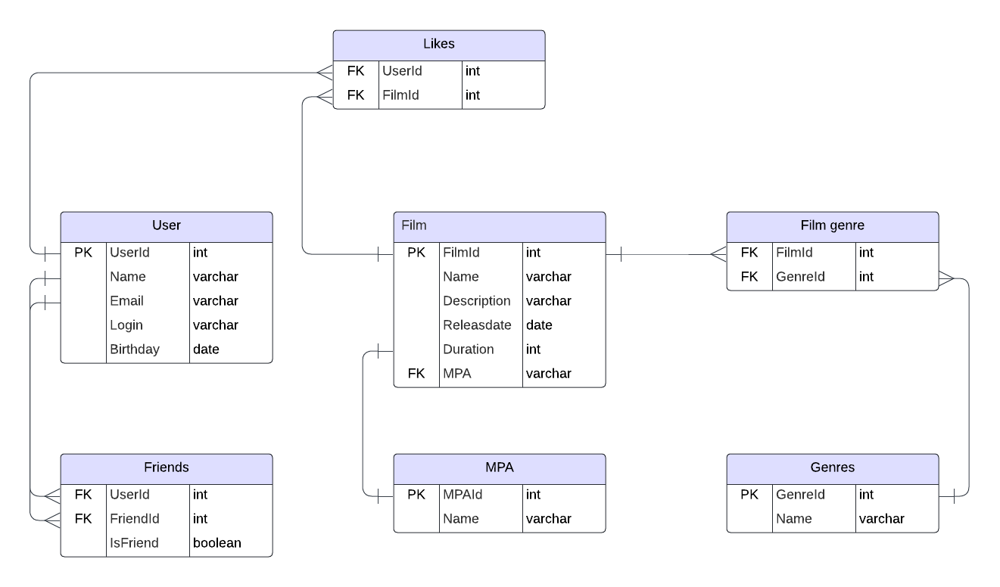

# java-filmorate
Template repository for Filmorate project.

# Примеры запросов

Запрос который выведет все фильмы жанра хоррор вышедших в 2018 году 
SELECT f.Name AS FilmName, f.Releasdate 
FROM Film f 
JOIN Film_genre fg ON f.FilmId = fg.FilmId 
JOIN Genres g ON fg.GenreId = g.GenreId 
WHERE g.Name = 'хоррор' AND YEAR(f.Releasdate) = 2018; 

запрос который выведет топ-10 самых популярных фильмов жанра комедия длительностью 120 минут  
SELECT f.Name AS FilmName, COUNT(l.UserId) AS LikesCount 
FROM Film f 
JOIN Film_genre fg ON f.FilmId = fg.FilmId 
JOIN Genres g ON fg.GenreId = g.GenreId 
JOIN Likes l ON f.FilmId = l.FilmId 
WHERE g.Name = 'комедия' AND f.Duration = 120 
GROUP BY f.FilmId 
ORDER BY LikesCount DESC 
LIMIT 10; 

запрос который выведет кол-во добавленных друзей у пользователя 
SELECT COUNT(*) AS FriendsCount 
FROM Friends 
WHERE (UserId = <User_ID> AND IsFriend = true) OR (FriendId = <User_ID> AND IsFriend = true); 

запрос который отсортирует фильмы по убыванию возрастного ограничения 
SELECT f.Name AS FilmName, m.Name AS MpaName 
FROM Film f 
JOIN MPA m ON f.MPA = m.MPAId 
ORDER BY m.Name DESC; 

запрос который выведет любимый жанр фильмов конкретного пользователя 
SELECT g.Name AS GenreName, COUNT(l.UserId) AS LikesCount 
FROM Film_genre fg 
JOIN Genres g ON fg.GenreId = g.GenreId 
JOIN Film f ON fg.FilmId = f.FilmId 
JOIN Likes l ON f.FilmId = l.FilmId 
WHERE l.UserId = <User_ID> 
GROUP BY g.Name 
ORDER BY LikesCount DESC 
LIMIT 1; 
